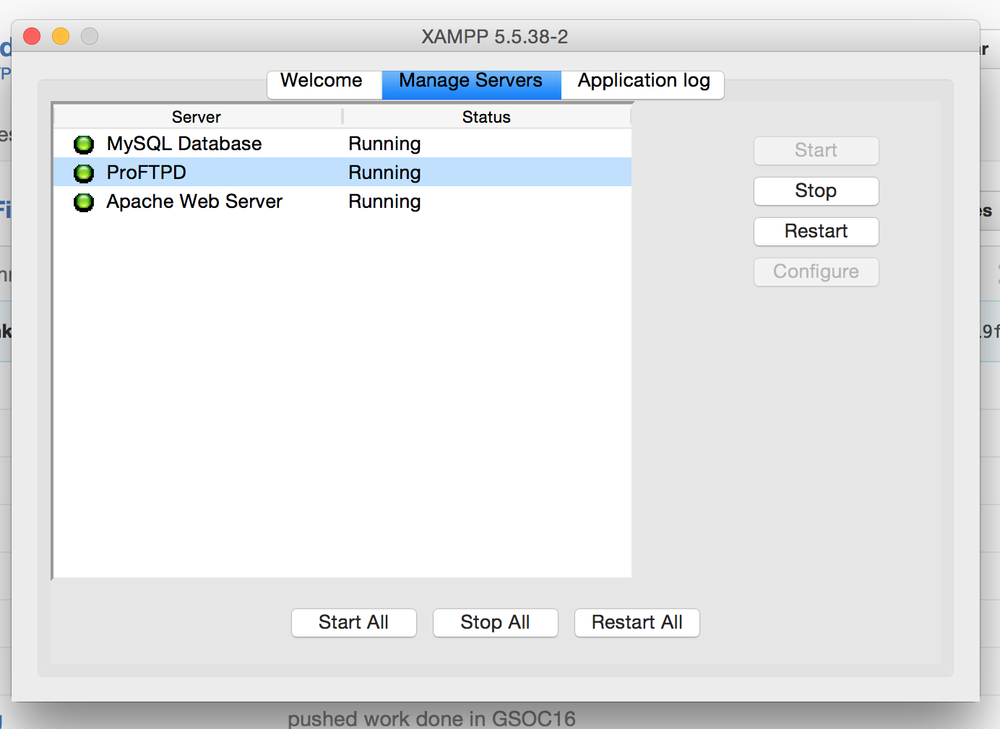
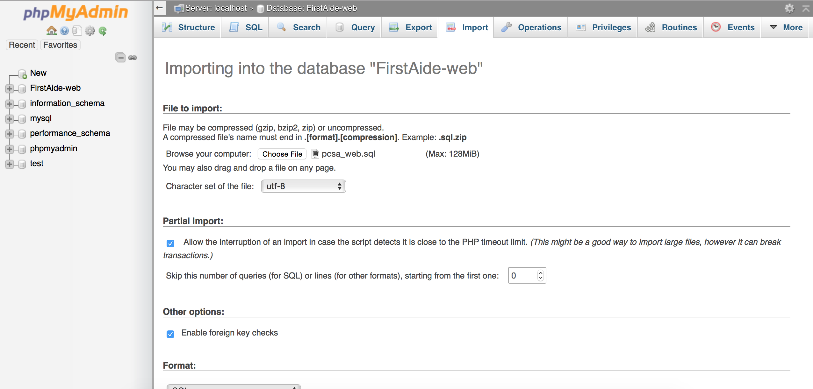
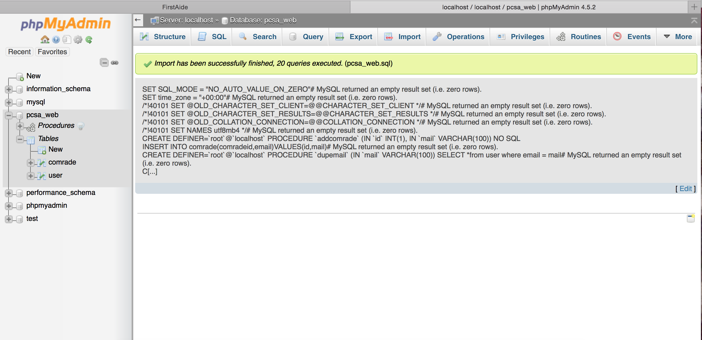
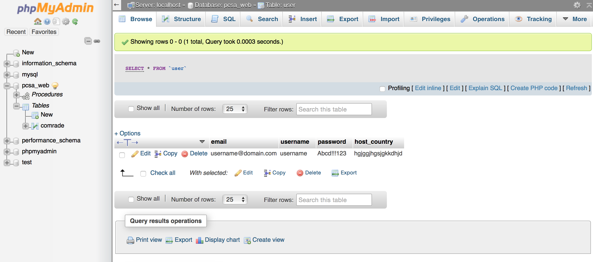

# FirstAide - Web App

The project repo of FirstAide-Web : [FirstAide-web repo](https://github.com/systers/FirstAide-web)

FirstAide is a web application being developed for the Peace Corps. Peace Corps aim to provide support to all the volunteers who have been sexually assaulted. The volunteers can get reporting procedures and other relevant information. The initiative is to provide commitment to the volunteers who are victims of sexual assault and also to ensure their safety.

The project is built using the following technologies:
 1. PHP (Backend)
 2. HTML and CSS (Frontend)
 3. Jquery and Javascript
 4. MySql (Database)

The welcome page of project

## Getting Started

### Installation
Download XAMPP from here [XAMPP download](https://www.apachefriends.org/download.html).You will also need a text editor (Sublime or Notepad++) 

Go to your terminal and execute this command

    $ git clone https://github.com/systers/FirstAide-web

Or download the ZIP file from above

###Opening and Running
1. Launch XAMPP by opening XAMPP control panel
2. Start 'Apache' and 'MySQL'

3. Check if XAMPP has started using the url 'http://localhost:8080/' (Here 8080 is the port number, use the one which you have configured)
4. Now extract the ZIP file of the project FirstAide-web which you have downloaded and paste it in the C:\xampp\htdocs (the path where your xampp is present)
5. Open the file which you want to work with using the text editor you have downloaded
6. Make the required changes and save the file
7. Now, view your changes using the url http://localhost:8080/directory_name/file_name.extension  Example: 'http://localhost:8080/FirstAide-web/login.html'

###Database Setup
1. Go to 'http://localhost/phpmyadmin', in the top menu bar of the phpMyAdmin panel, click on Import. Now, click on 'Choose the file'. Select the firstaide_web.sql file present in database folder of this project.

2. Click import to successfully import the file.

3. Reload the http://localhost:8080/FirstAide-web/login.html webpage and signup as a new user. Check the table 'user' in the database 'firstaide_web' and confirm that a new record has been created.

###Documentation

The documentation can be found here

1.[project docs](https://github.com/systers/FirstAide-web/tree/master/project-docs)

2.[docs of GSOC 16](https://github.com/systers/FirstAide-web/tree/master/work-docs)

###Guide to Naming Convention Used
[Conventions and rules](https://google.github.io/styleguide/htmlcssguide.html)

###How to Use CALL and SMS feature
This project makes use of Twilio for sending SMS and making CALLS. Twilio is a third party platform which provides API in PHP for serving the purpose.
SMS and Call had been used in:
Get Help Now module
Group SMS in :
Circle of Trust module

Read more about Twilio here: [Twilio](https://www.twilio.com/)

####Steps to enable Twilio in your localhost
1. Get started with SMS and Call by creating an Account on Twilio here : [Twilio Register](https://www.twilio.com/try-twilio)
2. Setting Account SID and Token
   
   Take the Account SID and Token provided by Twilio here [Your Twilio Credentials](https://www.twilio.com/console)
   
   Paste them at the correct places in  the twilioSMS.php, twilioCall.php and groupsms.php files
3. Setting From Number
   Get a phone number from Twilio here: [Twilio phone number](https://www.twilio.com/console/phone-numbers/dashboard).

   Use this as the from number in the files twilioSMS.php, twilioCall.php and groupsms.php
4. Setting To Numbers :
   If you are using Twilio Trial Account you can send a SMS or make a Call to a Twilio verified number only. Upgraded accounts may not   need to verify a number

   Procedure to verify a number in Twilio
   1. Go to (https://www.twilio.com/console/phone-numbers/dashboard)
   2. Then on the left side vertical menu select Verified Caller IDs
   3. Click the + symbol and verify a number
   
   After getting the numbers verified it's time to use this numbers to test the feature
   While adding the numbers make sure you enter the country code as well else, it won't work.
   #####Use in Get Help Now module
   1. Go to javascripts/getHelpNowPhNo.js
   2. Replace the sample numbers to your verified numbers
   3. Make Call or Send SMS from the App
  
   #####Use in Circle of Trust module
   1. Open the app
   2. Go to Circle of Trust from the menu
   3. Click edit icon
   4. Add your verified numbers there
   5. Submit and go back to Circle of Trust
   6. Click Help Me icon and select a message
   7. An alert pops out saying 'Success' once messages are sent

References : 

[Tutorial for SMS](https://www.youtube.com/watch?v=jZPeNfLD5Yc)

[Tutorial for Group SMS](https://www.youtube.com/watch?v=G4oluQf_7S4)

## Contributing 
If you want to contribute to FirstAide-Web, subscribe to our [systers-dev](http://systers.org/mailman/listinfo/systers-dev) mailing list and shoot an introductory email or you can join our slack channel as well. Pick an open issue from the [issue list](https://github.com/systers/FirstAide-Web/issues), claim it in the comments and wait for approval, fix the issue and send a pull request. 
If you find an issue yourself you can report it, a community member will get back to you and approve the issue. Then you can fix it and submit a PR. Please go through our issue list first and make sure the issues you are reporting  do not replicate the issues already reported. If you have issues on multiple pages, report them separately. Do not combine them into a single issue.

### Rules for Contributing
1. Do not fix a new issue and submit a PR without reporting and getting it approved at first.
2. Do not fix an issue assigned to somebody else and submit a PR before the assignee does. 
3. Do not report issues which are previously reported by others. (Please check the closed issues too before you report an issue). 
4. Do not suggest completely new developments in the issue list. (Please use the mailing list for this kind of suggestions. Use issue list to suggest bugs/features in the already implemented sections.)
5. If an issue is reported by a person, it is automatically assigned to that person
6. Use meaningful commit messages and squash all your commits into one
7. Only pick the issues which are labeled as free
8. Do not create new issues if unresolved issues created by you are pending
9. When you create a PR for an issue reference that issue in the comments section of the PR.
